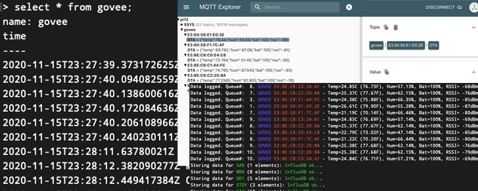
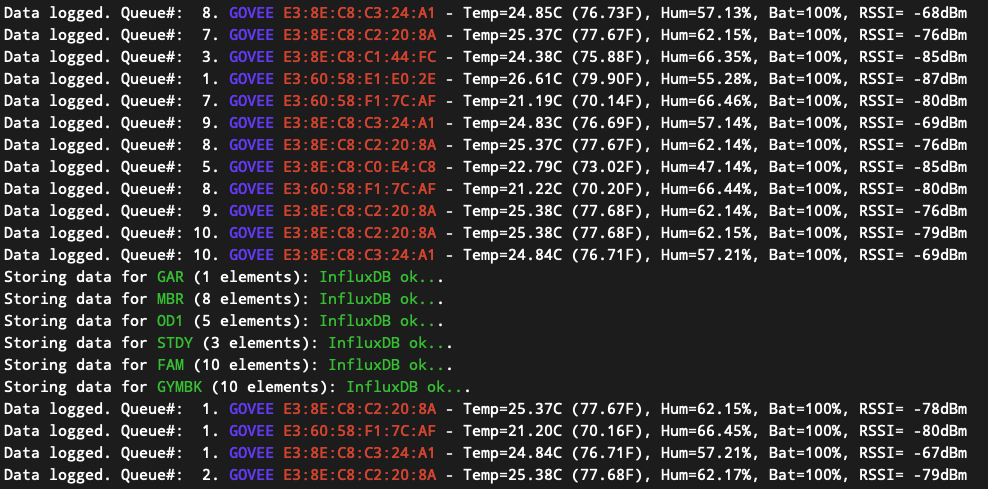
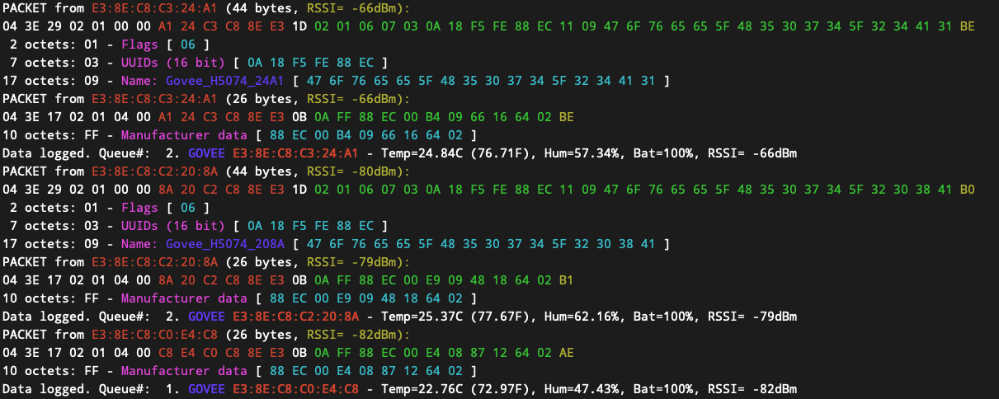
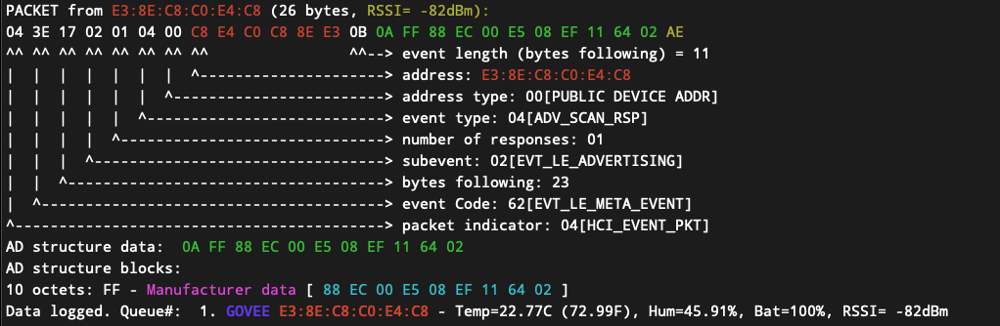

# govee-gateway
     
>A BLE Gateway to MQTT/InfluxDB for Govee H5074 temperature sensors.

## General info
The Govee Gateway is built based on my govee-ble-scanner (https://github.com/w1gx/govee-ble-scanner). It uses a HCI connection to scan for packets of type HCI_EVENT_PKT (04) with event types of EVT_LE_META_EVENT and extracts all advertising data from them. It then looks for AD type identifiers of 0xFF (manufacturer data), and within those for the company identifier 0x88EC, which contain the encoded temperature and humidity.For more detail about this process please refer to the wiki of the govee-ble-scanner and the Bluetooth Core Specification at https://www.bluetooth.com/specifications/bluetooth-core-specification/.
Depending on the configuration, the Govee Gateway sends temperature and humidity data in configurable intervals to MQTT and/or InfluxDB.

## Technology

The Govee BLE Gateway is written in C++ and tested on Raspberry Pis. Besides the standard libraries, it requires libbluetooth and - if MQTT is required - paho.mqtt.cpp.

It uses the following modules:
- INIReader (https://github.com/benhoyt/inih)
- influxdb-cpp (https://github.com/orca-zhang/influxdb-cpp)
- optional: paho.mqtt.cpp (https://github.com/eclipse/paho.mqtt.cpp)

## Setup
### Prerequisites
The Govee Gateway can be installed with MQTT assistance, in which case the paho-mqtt-cpp library must be installed. Please follow the steps as described at https://github.com/eclipse/paho.mqtt.cpp.
In any case, the following needs to be installed:

	sudo apt-get install bluetooth bluez libbluetooth-dev

### Make
The application can be built with or without mqtt support.
#### make without mqtt support:
	make release
#### make with mqtt support
	make release MQTT=1

#### generating doxygen documentation
	sudo apt-get install doxygen graphviz
	make doc

#### making the deb package

After making the release file, run the following

	make deb

The deb file is in **./deb/govee-gateway.deb**. To install it, run

	sudo apt-get install ./deb/govee-gateway.deb

The status can then be checked within

	sudo service govee-gateway status

### Configuration

The system can be configured in a config file, which is located in the root of the project folder. The config file can be passed on via command line parameters (see below). It contains the MQTT and InfluxDB configuration. If a host field is left empty, logging will be disabled for the section.

	; Configuration file for govee-gateway

	[system]
	verbosity = 1                   ;; 0=none, 1=show temp readings, 2=show BLE packets, 3=show BLE detail
	logInterval = 30                ;; log interval in seconds (logging to MQTT/InfluxDB)

	[mqtt]
	host = localhost:1883
	username =
	password =
	topic = govee

	[influxdb]
	host = 127.0.0.1
	port = 8086
	username =
	password =
	database = goveeDB
	measurement = govee

	[AddressMap]
	E3:8E:C8:xx:xx:xx = SOMENAME    ; Family room
	E3:60:58:yy:yy:yy = SOMENAME2   ; Master bedroom

The InfluxDB database must already exists, the Govee Gateway does not create databases. Also, all data is logged to mqtt (if enabled), but only data from devices that are mapped in the "AddressMap" section are logged to InfluxDB.

## Running the application

### from the command line

sudo ./deb/govee-gateway/usr/local/bin/govee-gateway

	Usage: ./build/release/govee-gateway [options]
  	Options:
    	-h | --help               print this message
    	-c | --config <file>      path to the config file
    	-i | --interval <seconds> reporting interval in seconds
    	-v | --verbosity <level>  debug level

The command line options override the parameters in the config file.

### as a service

If the gateway has been installed as a service (see above), the system starts it automatically.

Starting the service:
    sudo service govee-gateway start

Stopping the service
    sudo service govee-gateway stop
    
Note that when you run the application as a service, the configuration file in /etc (/etc/govee-gateway.conf) will be used.

## Console Output

The console output depends on the verbosity level selected (see above). A higher verbosity level can help in identifying problems with sensors and packet decoding.

**Level 0:** No Output

**Level 1:** only measurements

**Level 2:** BLE packets

**Level 3:** BLE details

## Status
At this point the system does what I need, although I am not hundred percent confident that the battery status field is really correct. Since there is no official documentation, all I can do is monitor it, and potentially come back and correct it.
